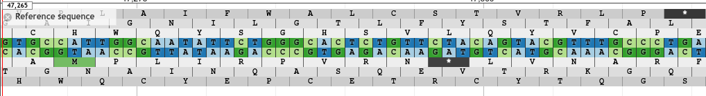
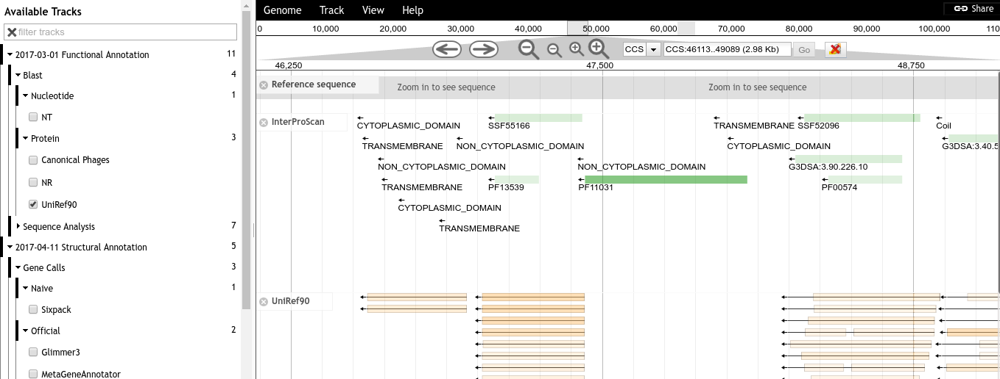
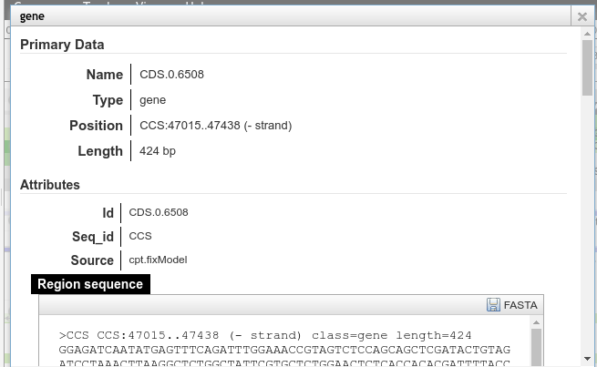

# ThemeComponent-Colors-BlackWhite-BlueGreen

A JBrowse 'Theme Component' which provides a pleasant minimalist black, white, and "fresh" (i.e. green) theme.





# Usage

Add the following to your `trackList.json`. If you have an existing plugins section, you should add the plugin to that section.

```json
"plugins": [
	{
		"name": "ThemeComponent-Colors-BlackWhite-BlueGreen",
		"location" : "https://cdn.rawgit.com/jbrowse-themes/ThemeComponent-Colors-BlackWhite-BlueGreen/b6fa92426325491e124cea92392edeb65eda3c72"
	}
]
```

# LICENSE

GPL-3.0

# Support

This material is based upon work supported by the National Science Foundation under Grant Number (Award 1565146)
